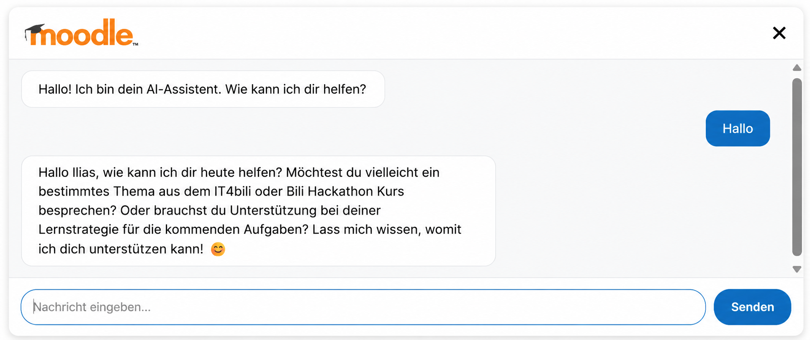
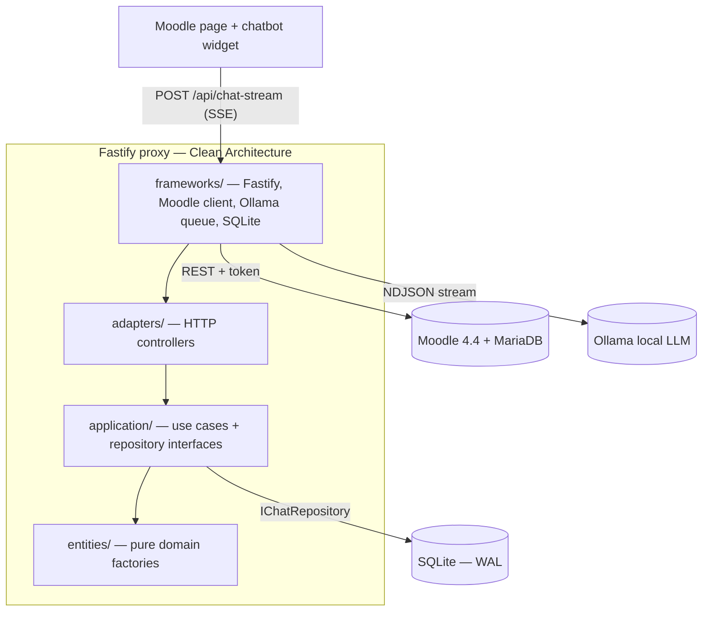

# Moodle AI Chatbot

> AI-powered learning assistant embedded in Moodle — students ask questions in natural language, the chatbot searches the course catalogue and answers using a local LLM. No data leaves the school server.


---

## Highlights

- 🔐 **Private by design** — runs entirely on the school server; the local LLM does inference offline and no student data leaves the host.
- 🛡️ **Identity you can trust** — Moodle signs each user with HMAC-SHA256; the proxy verifies it and enforces per-session ownership. The browser never sends a trusted `userId`.
- 🎯 **Grounded answers** — course search is *fail-closed* to the student's own enrolments, so the assistant only ever discusses courses they are in.
- 🧱 **Clean Architecture** — four layers, dependencies point inward, use cases are unit-testable without Fastify, Docker, Moodle, or Ollama.
- ⚙️ **Hardened by default** — sanitized output (DOMPurify + CSP), per-IP & per-user rate limits, an Ollama circuit breaker, and graceful shutdown.
- 🐳 **One command to run** — `docker compose up` brings up Moodle, MariaDB, Ollama, the proxy, and nginx together.

**Stack:** Node.js 20 · Fastify 5 · Ollama · Moodle 4.4 (MariaDB) · SQLite (WAL) · Docker Compose · Vitest · Clean Architecture

---

## Table of Contents

- [Highlights](#highlights)
- [Demo](#demo)
- [Project Story — Before → After](#project-story--before--after)
- [Requirements](#requirements)
- [Quick Start](#quick-start)
- [Environment Variables](#environment-variables)
- [API Endpoints](#api-endpoints)
- [Architecture](#architecture)
- [Development](#development)
- [Security Notes](#security-notes)
- [Limitations](#limitations)
- [Troubleshooting](#troubleshooting)
- [Related Docs](#related-docs)
- [License](#license)
- [Credits](#credits)

---

## Demo



The widget is embedded directly into a Moodle course page. A student types a
question; the proxy resolves their enrolments, searches only those courses,
builds a grounded prompt, and streams the answer token-by-token over SSE.

```
Student question
      │
      ▼
[ Moodle page ]──signed userId(ts,sig)──▶[ Fastify proxy ]
                                              │  verify HMAC identity (401 on fail)
                                              │  validate + rate-limit input
                                              │  search ONLY enrolled courses (fail-closed)
                                              ▼
                                        [ Ollama LLM ]──NDJSON──▶ SSE stream ──▶ sanitized HTML
```

---

## Project Story — Before → After

This started as a working prototype and was finished into a credible
production-lite service for the DEV Finish-Up-A-Thon.

| Area | Before (prototype) | After (this repo) |
|------|--------------------|-------------------|
| **Identity** | `userId` trusted from the request body (IDOR) | HMAC-SHA256 signed identity, constant-time verify, per-session ownership checks (`401`/`403`) |
| **Architecture** | Logic mixed into routes | Clean Architecture, 4 layers, dependency rule enforced, use cases unit-testable without Fastify/Docker |
| **AI grounding** | Model saw all courses | Course search **fail-closed** to the student's own enrolments; no secrets reachable by the model |
| **Frontend XSS** | Raw `innerHTML` of model output | DOMPurify (vendored) + tag/attr allowlist + Moodle-origin-locked anchors; CSP backstop |
| **Reliability** | Direct fetch, no limits | Timeout + retry (Moodle), circuit breaker + bounded queue (Ollama), graceful shutdown, SSE abort on disconnect |
| **Persistence** | In-memory only | SQLite (WAL, prepared statements, indexed, retention pruning) behind `IChatRepository` |
| **Deploy** | Manual | Multi-stage non-root Docker image, healthchecks, ordered startup, one-command Compose |
| **Quality gate** | None | 400+ tests, ESLint, Prettier, `npm audit`, Gitleaks, Trivy image scan, container smoke test in CI |

**How AI assisted:** GitHub Copilot / Claude Code were used to accelerate the
finishing work — hardening the auth layer, writing the adversarial input-guard
and sanitizer tests, and reviewing Clean Architecture boundaries. Every change
was test-gated; see the commit history for the completion arc.

### Production Readiness Checklist

- [x] Starts with a single `docker compose up` (env validated, fails fast)
- [x] No secrets committed (`.env` ignored, Gitleaks in CI)
- [x] HMAC identity verification + per-session authorization
- [x] Input validation, prompt-injection filter (best-effort), per-IP & per-user rate limits
- [x] LLM output sanitized (DOMPurify) + CSP without `unsafe-inline`
- [x] Ollama failure handled (timeout, retry-free circuit breaker, `503` backpressure)
- [x] Moodle failure handled (retry with backoff, graceful degradation)
- [x] SQLite persistence with WAL, retention pruning, mounted volume
- [x] Container healthcheck + graceful shutdown (SIGTERM/SIGINT)
- [x] CI: lint, format, tests + coverage, dependency audit, secret scan, image build & smoke test
- [x] Demo screenshot in README (animated recording optional — see [Demo](#demo))
- [x] Limitations documented honestly (see [Limitations](#limitations))

---

## Requirements

| Component | Version | Notes |
|-----------|---------|-------|
| OS | Linux x86_64 | WSL2 also works |
| Docker | 24+ | Compose plugin required |
| Node.js | 20 LTS | Local development only |
| Disk | ≥ 10 GB free | Moodle + LLM model |

---

## Quick Start

**1. Clone and configure**
```bash
git clone <repo-url> && cd raspi
cp .env.example .env
# Edit .env — set MOODLE_TOKEN, passwords, CORS_ORIGIN
```

**2. Start all services**
```bash
cd compose && docker compose --env-file ../.env up -d
```

> In the production stack the proxy is **not** published to the host — it is
> reached only through nginx (`/chatbot/`, `/api/`, `/health`) on your domain.
> For local testing without nginx/SSL, add the local override, which publishes
> the proxy on `localhost:3000` and disables nginx:
> ```bash
> docker compose -f docker-compose.yml -f docker-compose.local.yml --env-file ../.env up -d
> ```

**3. Pull the LLM model** (once, ~2 GB for the default local model)
```bash
docker exec -it ollama ollama pull llama3.2:3b
```

For Ollama Cloud models such as `gpt-oss:120b-cloud`, sign in inside the Ollama
container first, then pull the cloud model marker:

```bash
docker exec -it ollama ollama signin
docker exec ollama ollama pull gpt-oss:120b-cloud
```

**4. Get the Moodle webservice token**
- Open `http://localhost:8080` and log in as `admin`
- Navigate to: *Site administration → Plugins → Web services → Manage tokens*
- Create a token for the `moodle_mobile_app` service
- Add it to `.env` as `MOODLE_TOKEN=<token>`, then:
  ```bash
  docker compose restart proxy
  ```

**5. Verify**

With the local override from step 2 (proxy published on port 3000):
```bash
curl http://localhost:3000/health
# {"status":"ok",...,"services":{"moodle":"ok","ollama":"ok"}}
```

In the production stack, verify through nginx instead: `curl https://<your-domain>/health`.

The chatbot widget is served at `/chatbot/` — `http://localhost:3000/chatbot/`
with the local override, or `https://<your-domain>/chatbot/` in production. It is
meant to be embedded into Moodle pages via the snippet in
[`proxy/public/chatbot/moodle-embed.html`](proxy/public/chatbot/moodle-embed.html).

---

## Environment Variables

All variables with descriptions are in [`.env.example`](.env.example). Copy it to `.env` and fill in the secrets — never commit `.env`.

| Variable | Example | Purpose | Where to get |
|----------|---------|---------|--------------|
| `MOODLE_TOKEN` | `abc123...` | Moodle webservice token | Moodle admin → Web services → Tokens |
| `MOODLE_URL` | `http://moodle:8080` | Internal Moodle URL (Docker network) | Fixed — do not change |
| `PUBLIC_MOODLE_URL` | `https://www.itech-bs14.de` | Public URL shown in course links | Your domain |
| `OLLAMA_MODEL` | `llama3.2:3b` | LLM model name | Must be pulled first |
| `CORS_ORIGIN` | `http://localhost:8080` | Comma-separated allowed origins | Your Moodle URL |
| `CHAT_DB_PATH` | `/data/chat.db` | SQLite path for chat history | Docker volume `/data` |
| `CHATBOT_AUTH_SECRET` | `<32-byte hex>` | HMAC secret for Moodle identity (required in prod) | Same value configured in Moodle |
| `CHAT_RETENTION_DAYS` | `90` | Idle sessions pruned on startup (`0` disables) | Operational preference |

---

## API Endpoints

| Method | Path | Auth | Description |
|--------|------|------|-------------|
| `POST` | `/api/chat-stream` | Signed Moodle identity (HMAC) + chatId ownership | Streaming chat response (SSE) |
| `GET` | `/api/chat-history/:chatId` | Signed identity + ownership | Fetch a session's history |
| `DELETE` | `/api/chat-history/:chatId` | Signed identity + ownership | Clear a session |
| `GET` | `/health` | none | Liveness/readiness check with dependency status |
| `GET` | `/moodle/ping` | none | Connectivity probe (no data) |
| `POST` | `/admin/cache/invalidate` | localhost only | Invalidate the Moodle course cache |

> Diagnostic endpoints `GET /moodle/user/:id`, `GET /moodle/users/:userId/courses`
> and `GET /moodle/debug/cache` return user data only in non-production and
> respond `404` when `NODE_ENV=production`.

Authentication: the browser never sends a trusted `userId`. Moodle signs
`${userId}.${ts}` server-side with `CHATBOT_AUTH_SECRET` (HMAC-SHA256); the proxy
recomputes the signature and rejects unsigned, tampered, or expired requests
with `401`. See [`proxy/public/chatbot/moodle-embed.html`](proxy/public/chatbot/moodle-embed.html).

---

## Architecture

The proxy follows **Clean Architecture** with four layers. Dependencies flow inward only:

```
frameworks → adapters → application → entities
```



Dependencies point inward only: `frameworks → adapters → application → entities`.
Swapping SQLite for Postgres or Ollama for another LLM is localized to
`frameworks/` because `application/` depends only on the interfaces.

```
proxy/src/
├── entities/          # Pure domain factories (ChatMessage, Course, UserProfile)
├── application/       # Use cases + repository interfaces (no infra imports)
├── adapters/          # HTTP controller factories (Fastify-specific code lives here)
├── frameworks/        # Concrete implementations (Moodle, Ollama, SQLite, Fastify)
├── middleware/        # inputGuard, errorHandler, auth, rate limiting
├── config/            # env.js (validated config), constants.js
└── app.js             # Composition Root — only file that wires all layers
```

### Key Files

| Path | Purpose |
|------|---------|
| `proxy/src/app.js` | Composition Root — start here to understand DI wiring |
| `proxy/src/config/env.js` | Validated config (fails fast on missing vars) |
| `proxy/src/middleware/inputGuard.js` | Security input validation |
| `proxy/src/application/useCases/chat/streamChat.js` | Core chat logic |
| `compose/docker-compose.yml` | Full infrastructure definition |
| `.env.example` | All environment variables with descriptions |

Full architecture specification: [`ARCHITECTURE.md`](ARCHITECTURE.md)  
Quick agent reference: [`ARCHITECTURE_SUMMARY.md`](ARCHITECTURE_SUMMARY.md)

---

## Development

```bash
# Install dependencies
cd proxy && npm install

# Run in development mode (auto-restart on change)
npm run dev

# Run tests
npm test

# Run tests with coverage
npm run test:coverage

# Lint
npm run lint
```

Coverage targets: `entities/` ≥ 90% · `application/` ≥ 80% · overall ≥ 70%

---

## Security Notes

- **Identity is never trusted from the client.** Moodle signs the user id
  server-side (HMAC-SHA256 over `${userId}.${ts}` with `CHATBOT_AUTH_SECRET`);
  the proxy rejects unsigned, tampered, or expired tokens with `401`, and
  enforces per-session ownership on chat-stream and chat-history (`403` on
  mismatch).
- **LLM output is sanitized** with DOMPurify (vendored) against a narrow tag/attr
  allowlist before it touches `innerHTML`; anchors are restricted to the Moodle
  origin. CSP (`script-src 'self'`, no `unsafe-inline`) is a backstop.
- **Input is validated** at the boundary (type, length, prompt-injection
  patterns) and rate-limited per IP and per user.
- **The Moodle webservice token never reaches the browser or the LLM prompt.**
- **Prompt-injection defense is best-effort.** The regex blocklist is a cheap
  first filter, not a guarantee — the real boundary is that the system prompt is
  not a secret and no secrets are reachable by the model. Course search is
  fail-closed to the user's own enrolments.
- Diagnostic `/moodle/*` data endpoints are disabled in production.

---

## Limitations

- **SQLite, single instance.** Chat history is a single SQLite file (WAL mode).
  Fine for a school deployment / production-lite; horizontal scaling would need
  Postgres and a shared rate-limit/queue store. The Clean Architecture
  boundaries (`IChatRepository`) make that swap localized.
- **Rate limiting and the Ollama queue are in-memory** — per process, reset on
  restart, not shared across replicas.
- **Session retention runs on startup**, not on a timer (see
  `CHAT_RETENTION_DAYS`); a long-lived process prunes again only on the next
  restart/deploy.
- **Local LLM quality** depends on the pulled model (default `llama3.2:3b`);
  answers are scoped to Moodle course content by design.
- **Backups:** `chat.db` is captured via a consistent SQLite snapshot, but the
  MariaDB data dir is copied at the file level — stop the stack or use
  `mysqldump` for a fully consistent backup under load (see `docs/setup.md`).

---

## Troubleshooting

### 1. Proxy container exits immediately

**Symptom:** Container stops right after `docker compose up`, logs show:
```
Error: Missing required env var: MOODLE_TOKEN
```
**Cause:** `.env` file is missing or a required variable is not set. In
production (`NODE_ENV=production`) `CHATBOT_AUTH_SECRET` is **also required** and
the proxy refuses to start without it.  
**Fix:** Copy `.env.example` to `.env`, fill in all required values, and generate
the auth secret:
```bash
node -e "console.log(require('crypto').randomBytes(32).toString('hex'))"
# put the output in .env as CHATBOT_AUTH_SECRET=...
```
Then start with `docker compose --env-file ../.env up -d`. The proxy fails fast
on missing config by design.

---

### 2. Chat returns "Moodle API error" or empty course list

**Symptom:** Every question returns an error or "no courses found".  
**Cause:** `MOODLE_TOKEN` is missing, expired, or lacks the correct service permissions.  
**Fix:**
1. Log in to Moodle → *Site administration → Plugins → Web services → Manage tokens*
2. Create or regenerate a token for the `moodle_mobile_app` service
3. Set `MOODLE_TOKEN=<token>` in `.env`
4. `docker compose restart proxy`

---

### 3. Chat hangs or returns no answer

**Symptom:** SSE connection opens but no tokens stream back; request times out.  
**Cause:** Ollama is running but the model has not been pulled yet.  
**Fix:**
```bash
# Pull the model
docker exec -it ollama ollama pull llama3.2:3b

# Or verify which models are available
curl http://localhost:11434/api/tags
```

---

### 4. Browser shows CORS error

**Symptom:** DevTools shows:
```
Access to fetch at '...' has been blocked by CORS policy
```
**Cause:** The origin of the Moodle page is not listed in `CORS_ORIGIN`.  
**Fix:** Add the embedding page's origin to `.env`:
```
CORS_ORIGIN=http://localhost:8080,https://www.itech-bs14.de
```
Then `docker compose restart proxy`.

---

### 5. Too many requests — 429 response

**Symptom:** After several messages the chatbot returns HTTP 429.  
**Cause:** The rate limiter enforces `RATE_LIMIT_MAX` requests per `RATE_LIMIT_WINDOW` per IP (default: 20/minute). This is intentional in production.  
**Fix for development:**
```bash
# In .env
RATE_LIMIT_MAX=100
RATE_LIMIT_WINDOW=1 minute
```
Restart proxy after changing `.env`.

---

## Related Docs

| Document | Purpose |
|----------|---------|
| [`ARCHITECTURE.md`](ARCHITECTURE.md) | Full Clean Architecture spec with code examples |
| [`ARCHITECTURE_SUMMARY.md`](ARCHITECTURE_SUMMARY.md) | Quick layer reference for agents |
| [`docs/setup.md`](docs/setup.md) | Setup procedures: SSL, token, model swap, backup |
| [`.env.example`](.env.example) | All environment variables with inline comments |
| [`docs/`](docs/) | Problem definition, requirements, setup, and prompt notes |

---

## License

Released under the [MIT License](LICENSE) © 2026 Ilias Almerekov.

---

## Credits

- Built on [Fastify](https://fastify.dev), [Ollama](https://ollama.com),
  [Moodle](https://moodle.org), [better-sqlite3](https://github.com/WiseLibs/better-sqlite3),
  and [DOMPurify](https://github.com/cure53/DOMPurify).
- Architecture follows Robert C. Martin's *Clean Architecture*.
